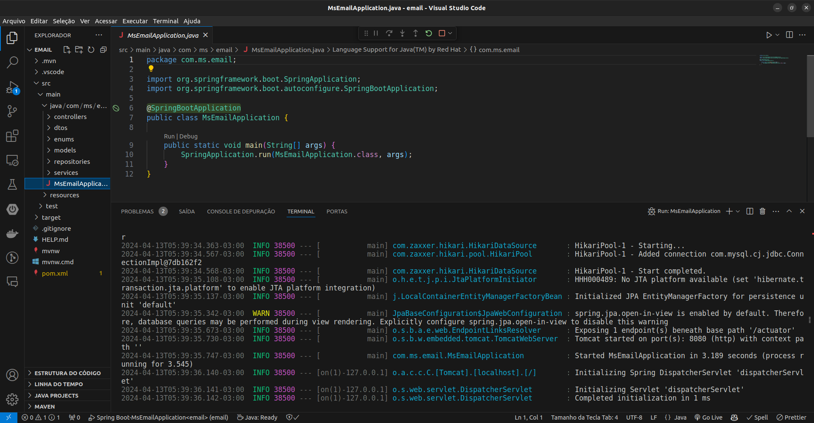

# email-API

> Api para envio e gerenciamento de emails.

    

## Sobre o Projeto

Uma API para enviar emails e armazenar as informações no banco de dados, fornecendo acesso aos detalhes de envio, como remetente, destinatário, assunto, texto e etc. Desenvolvida em Java com Spring Boot.

## Como Contribuir

1. Faça um fork do repositório
2. Crie uma branch para sua feature (`git checkout -b feature/MinhaFeature`)
3. Faça commit das suas mudanças (`git commit -am 'Adiciona uma nova feature'`)
4. Faça push para a branch (`git push origin feature/MinhaFeature`)
5. Abra um Pull Request

## Licença

Este projeto está licenciado sob a Licença MIT - veja o arquivo [LICENSE](LICENSE) para detalhes.

## Contato

- Raphael Vilete - [raphvilete@gmail.com](mailto:raphvilete@gmail.com)
